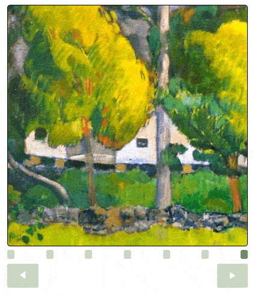

# react-modern-carousel

React Carousel component that allows you to use it for **texts**, **images** and **videos**.
Fairly simple implemantation, it has only **infinite** and **interval** options and supports **pointer** and **touch events** to swipe cards for mobile / web usage.

*Built with React, React Hooks, Webpack, Typescript*

Steps to run
1. clone repo
2. npm install & npm start

